# U-GAT-IT 百度飞桨论文复现
&emsp;&emsp;百度飞桨论文复现Unsupervised Generative Attentional Networks with Adaptive Layer-Instance Normalization for Image-to-Image Translation
1. [论文心得](https://github.com/liuxianyi/U-GAT-IT/blob/master/README.md#%E8%AE%BA%E6%96%87%E5%BF%83%E5%BE%97)
2. 论文PaddlePaddle([百度飞桨](https://aistudio.baidu.com/aistudio/))[复现](https://github.com/liuxianyi/U-GAT-IT/blob/master/README.md#复现)

# 论文心得
## 摘要
&emsp;&emsp;论文提出了一个新的方法在无监督条件下对图像实现意象到意象的转换，将注意力模块与新的可自主学习的归一化(normalization)相结合实现不错的效果。与传统的state-of-the-art模型项目，改论文提出的方法具有很大的优势。

&emsp;&emsp;注意力模块:更加关注区域的重要性，来区别源图与目标图。它能够把握住域之间的几何改变（整体改变，形状的改变）。
AdaLIN自适应层级归一化函数：帮助我们在不改变网络架构的情况下，灵活控制形状改变的数目，以及纹理的改变。
## 实现的方案
1. 整体结构由两个生成器(G(s->t)生成器1：原图像->目标图像；G(t->s)生成器2：目标图像->原图像。他们类似于cycle gan的操作）和两个判别器组成，并将注意力模块集成到两个生成器(attention model作用：不同域生成不同效果）和两个判别器$D_t、D_s$（attention model作用：指引生成器在指定区域生成逼真图片）。
2.  网络的结构
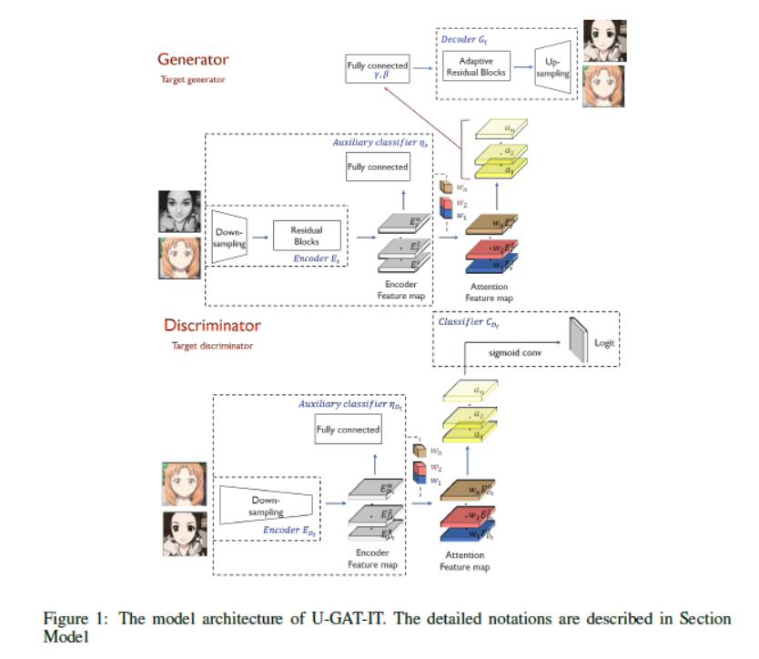
3. 判别器
判别器是一个多尺度模型，由编码器$E_{D_t}$,分类器$C_{d_t}$组成,辅助分类器${\eta}D_t$组成。分类器$C_{d_t}$，${\eta}D_t$用来判别是目标域图片还是生成器产生图片。利用注意力特征在$E_{D_t}$
4. 生成器
生成器$G_{s-t}$由编码器$E_s$和解码器$G_t$,辅助分类器${\eta}_s$组成.
5. 损失函数
总共四部分：
   1. 对抗损失 adversail loss：评价转换图像与目标图像分布的差异
   2. 循环损失 cycle loss :用来解决**模式坍塌**的问题，利用循环一致性来限制生成器。
   3. 特征的损失 identity loss:确保输入一输出颜色分布的相似性，使用特征一致性限制生成器。
   4. CAM loss: 对于辅助器${\eta}_s$和${\eta}D_t$,需要知道$G_{s-t}$和$D_t$改善那些地方，评价他们的域之间的差异。
   
总的损失：${\lambda}_{1}L_{lsgan}+{\lambda}_{2}L_{cycle}+{\lambda}_{3}L_{identity}+{\lambda}_{4}L_{cam}$

其中$L_{lsgan}$ = $L^{s-t}_{lsgan}+L^{t-s}_{lsgan}$
## 评估的效果
### CAM效果 
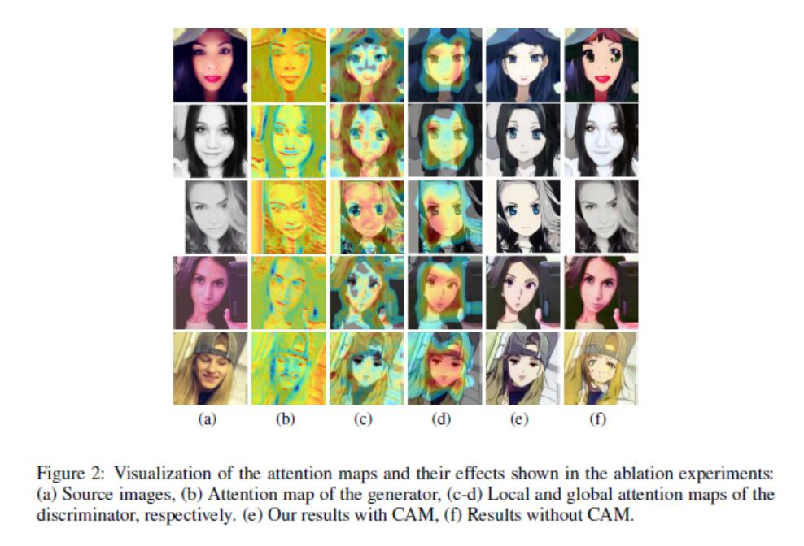

1. (e-f)在判别器和生成器加入attention model 后，网络会更加注意细节的部分，如嘴、眼睛。图像转换的效果更好。
2. (c-d)对于判别器关注的attention maps,生成器能够微调。能够将全局和局部相结合，取得更好的效果。

### AdaIN与其他四种Normalization的效果差别
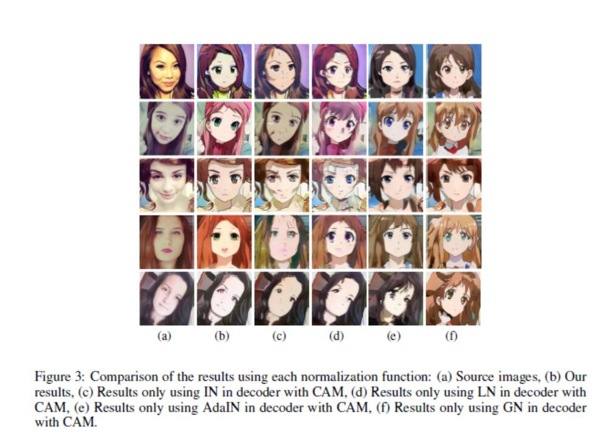
1. (c) 使用IN(instance normalization)能够很好的保留原域内容，但是转换的目标域风格的数量不是很充足。
2. (d) LN(Layer Normalization) 虽然能充分转换目标域的所有风格，但是原图的特征域保留的很少。
3. AdaIN 根据原域和目标域的分布情况采用不同比率的IN和LN实现，效果很好。

### 图片质量评估--不同网络(U-GAT-IT、Cycle-Gan、UNIT、MUNIT、DRIT、AGGAN),不同数据集之间效果对比
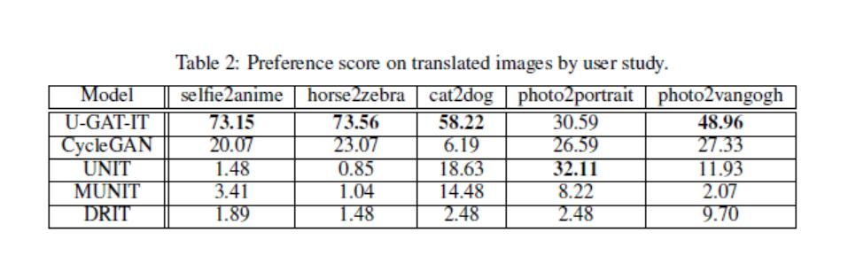
1. U-GAT-IT获得了最高的分数
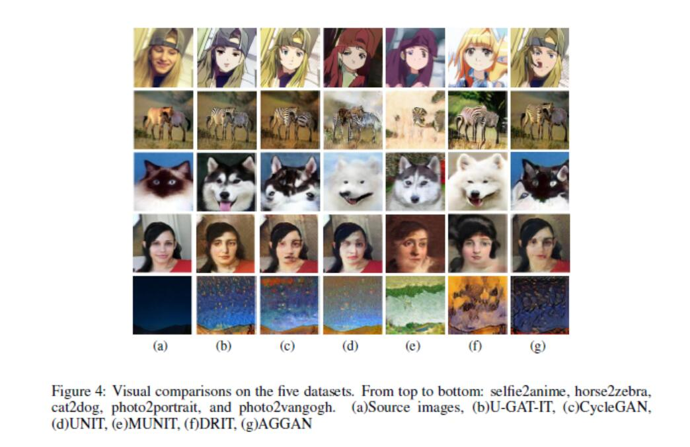
2. U-GAT-IT可以产生不形变的图片
### kernel Inception Distance(KID) 差异对比
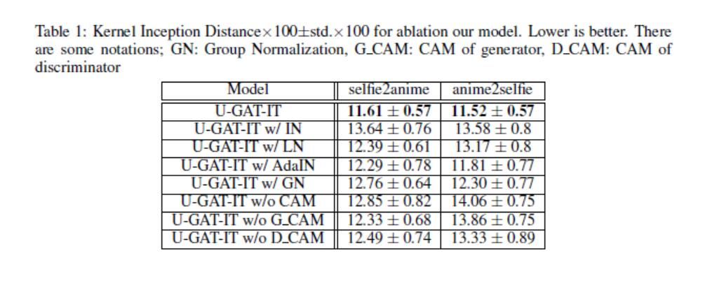
1. 当使用数据集selfie2anime时，U-GAT-IT有最小的KID值，效果最好。通过实验也证明了辅助分类器的attention maps可以指引生成器集中在原域和目标域的特定的区域。而且AdaLIN对于在不同数据集之间控制几何和风格的改变起着很大的作用。总是U-GAT-IT比其他同类模型有着巨大的优势。 
### 应用
### 总结
&emsp;&emsp;利用attention模块和AdaLIN在不同数据集中利用固定的网络架构和超参数可以产生视觉极佳的效果。
## 复现心得
&emsp;&emsp;本次复现过程真是充满挑战，一定程度上加深了对paddleAPI的更深层次的理解。
### 共提交了6次issue
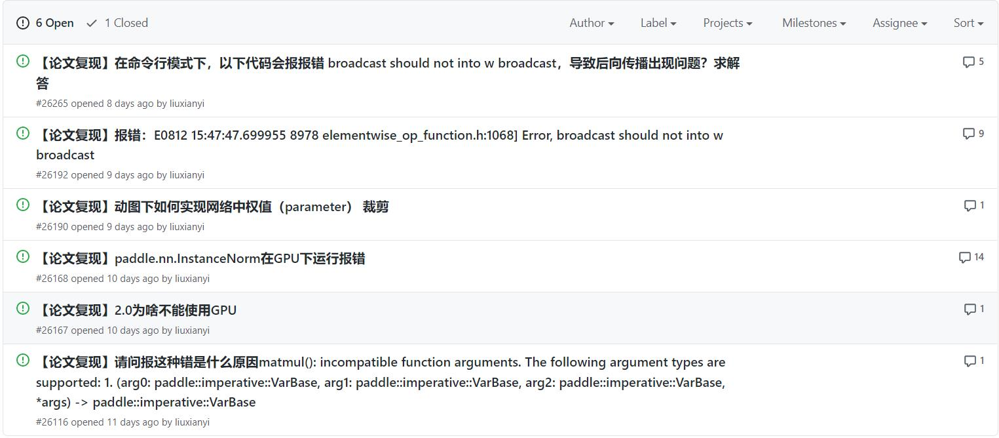
&emsp;&emsp;这两个问题 **【论文复现】报错：E0812 15:47:47.699955 8978 elementwise_op_function.h:1068] Error, broadcast should not into w broadcast**   和  **【论文复现】paddle.nn.InstanceNorm在GPU下运行报错**激起了热烈的讨论，不仅解决自己遇到的问题，而且也解决的别人遇到的同样的问题。

&emsp;&emsp;而且，paddle的工程师们都非常的尽职尽责，每次提问的issue都能在一个小时内得到解答，这一点真的超级赞。

### 遇到的问题及解决方案
#### 数据加载器（dataloader）的获取
&emsp;&emsp;由于1.8.x版本没有自带的数据加载器，于是我利用阅览paddle2.x源代码，在fluid.io模块中移植数据处理模块。并且借鉴了paddle的hapi模块，也进行了移植，实现了类似于torch的transform的功能，完成了数据的预处理。
#### 神经网络结构部分
&emsp;&emsp;在paddle1.8.x中并没有集成如var、SpectralNorm等模块，我通过从测试版本移植和提issue的方式获得了解决方案。
#### paddle的adam优化器如何加入多个优化参数
&emsp;&emsp;在官方版本中，作者使用pytorch实现的，他对参数使用iter进行实现，而这种方式却不能在paddle使用，这样会导致损失不能够下降，导致训练失败。正确的处理方式是直接传入拼接后的parameters。
### 初步训练结果
&emsp;&emsp;这几天aistudio都没停过，60+h的算力卡都跑完了，目前我的算力卡只剩1.9h，可项目不能停，多亏了我们善良、可爱、美丽的班班帮了我，若完成了复现心得，提前预支给了我200h的算力卡，班班太好了。

25000 iteration

30000 iteration

30000 iteration A2B

35000 iteration

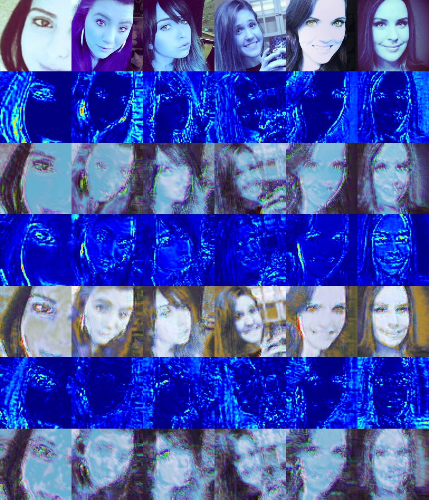

40000 iteration

45000 iteration

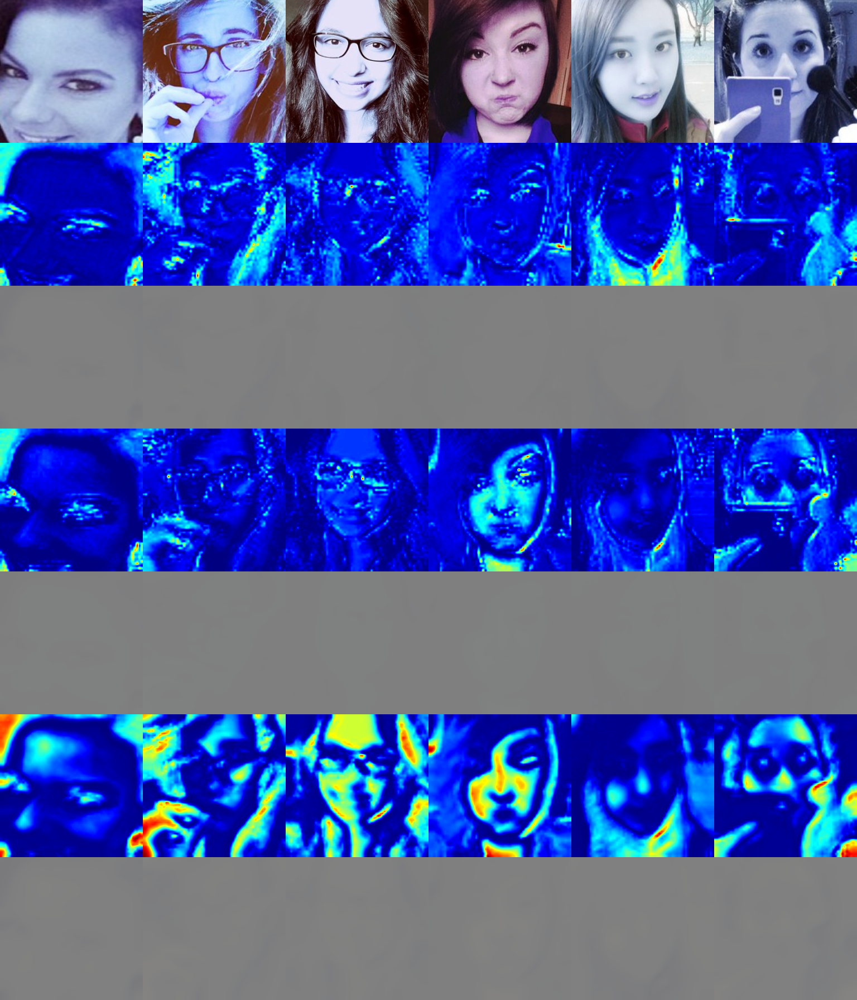

10 iteration 特征提取失败

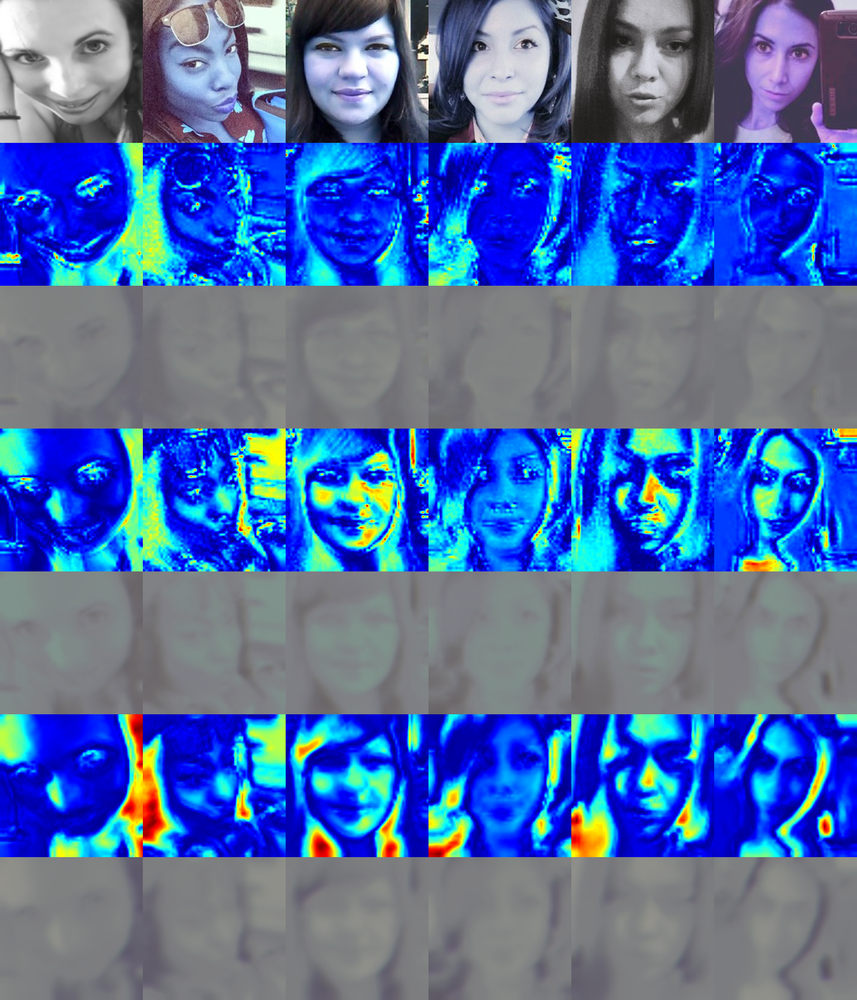

50 iteration 权值未能更新

4410 iteration 

360 iteration pytorch效果

### 总结
&emsp;&emsp;总之，目前网络跑通但是依然存在一些不足。目前训练的最长迭代次数约为6.5w，与作者论文中的100w相差甚远。目前网络训练结果与pytorch版本有些差距，可能依然存在参数未能对其的情况，仍需要找到原因。

### 当前运行效果

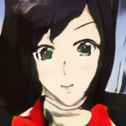

### 对比
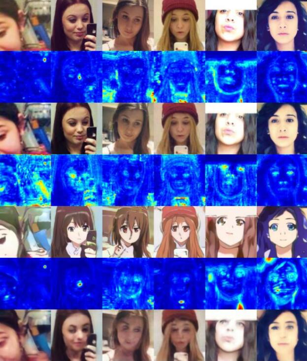